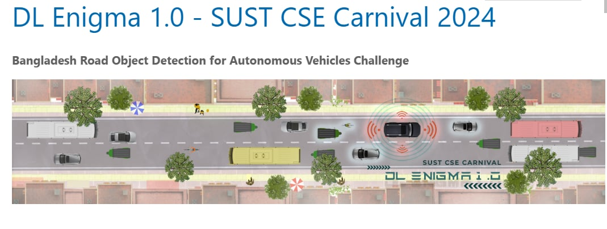
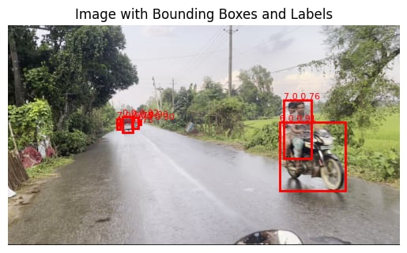
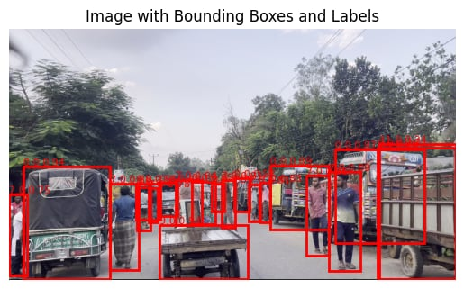
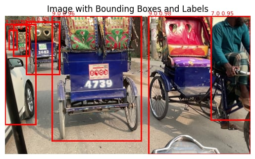
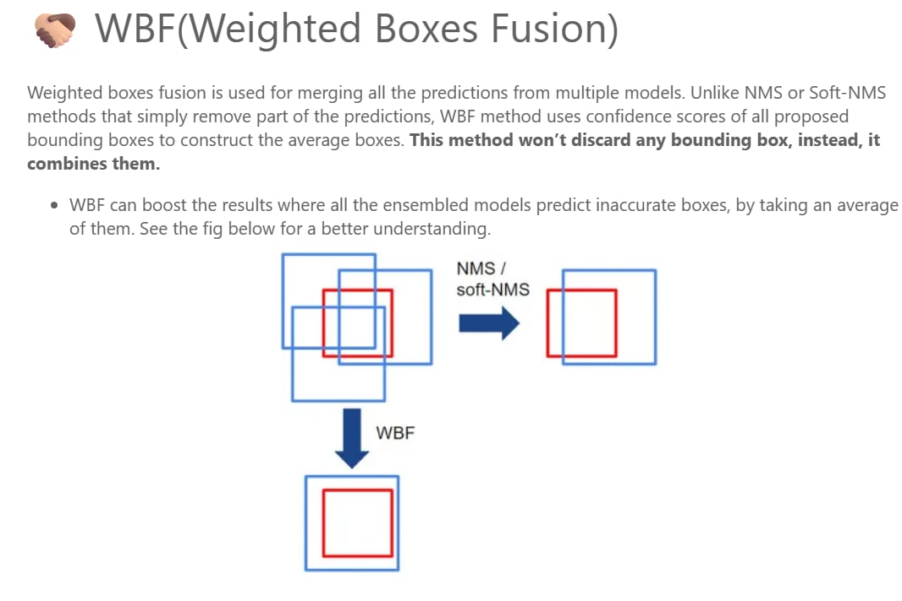

# RoadEye BD 🚗🇧🇩  
**Bangladesh Road Object Detection for Autonomous Vehicles**

**DL Enigma 1.0 (SUST CSE Carnival) – 1st Place in SUST**

 


## 📋 Project Overview

**RoadEye BD** is a real-time object detection system built specifically for the challenging and diverse road conditions of Bangladesh. It was developed for the **DL Enigma 1.0** competition (SUST CSE Carnival 2024) using the **BadODD** dataset and achieved **1st place within SUST**.

The system combines two **RT-DETR** models with **Weighted Box Fusion (WBF)** to deliver high accuracy on rare and small objects (wheelchairs, trains, construction vehicles, etc.) under varying lighting, occlusion, and motion conditions.


 
 
 
## ✨ Features

- Ensemble of two Ultralytics **RT-DETR** models (100 + 60 epochs)
- **13 Bangladesh-specific object classes** with strong performance on rare classes
- **Weighted Box Fusion (WBF)** instead of NMS → better rare-object detection
- Data augmentations (Flip + Mosaic) to handle class imbalance
- **FastAPI** REST API for production inference
- **Streamlit** interactive web UI with real-time camera support
- Full **Docker** deployment (CPU + GPU)
- Clean, well-documented code with configuration files


 

## 🏷️ Object Classes (13)

| ID | Class Name            | Notes                     |
|----|-----------------------|---------------------------|
| 0  | person                | Pedestrians               |
| 1  | three_wheeler         | CNG / easy-bike           |
| 2  | motorbike             | Motorcycles               |
| 3  | auto_rickshaw         | Auto-rickshaw             |
| 4  | car                   | Private cars              |
| 5  | truck                 | Trucks                    |
| 6  | bus                   | Buses                     |
| 7  | bicycle               | Bicycles                  |
| 8  | priority_vehicle      | Ambulance, police, fire   |
| 9  | cart_vehicle          | Hand-pulled / animal carts|
| 10 | construction_vehicle  | Excavators, rollers       |
| 11 | wheelchair            | Wheelchairs               |
| 12 | train                 | Trains (rail crossings)   |

## 📁 Project Structure

```bash
roadeye-bd/
├── models/                  # Trained weights
│   ├── model_100ep_last.pt
│   └── model_60ep_best.pt
├── src/
│   ├── inference.py         # WBF ensemble pipeline
│   └── wbf.py
├── api/                     # FastAPI backend
│   ├── main.py
│   └── schemas.py
├── ui/                      # Streamlit frontend
│   └── app.py
├── docker/                  # Dockerfiles
├── data/                    # Sample test images
├── requirements.txt
├── config.yaml              # Confidence, WBF params
├── Dockerfile
└── README.md


🛠️ Installation
Local Development
git clone https://github.com/yourusername/roadeye-bd.git
cd roadeye-bd

# Create virtual environment
python -m venv venv
source venv/bin/activate    # Windows: venv\Scripts\activate

# Install dependencies
pip install -r requirements.txt

# Download models (or place your .pt files in models/)


Docker (Recommended)
docker build -t roadeye-bd .
docker run -p 8000:8000 -p 8501:8501 roadeye-bd


🔬 Technical Details

Model: Ultralytics RT-DETR (Real-Time Detection Transformer)
Training:
Model 1 → 100 epochs
Model 2 → 60 epochs
Batch 16, image size 640, LR 0.018

Inference Pipeline:
Run both models
Collect boxes, scores, labels
Apply Weighted Box Fusion (weights=[1,1], iou_thr=0.4, skip_box_thr=0.001)

Augmentations: Horizontal flip + Mosaic
Why WBF? Normal NMS discards overlapping predictions; WBF fuses them → higher recall on rare classes.

📦 Dependencies (requirements.txt excerpt)
txtultralytics==8.3.0
fastapi==0.115.0
uvicorn==0.30.6
streamlit==1.39.0
Pillow
opencv-python-headless
ensemble-boxes
python-multipart
pyyaml
⚙️ Configuration (config.yaml)
YAMLinference:
  conf_threshold: 0.25
  iou_threshold: 0.4
wbf:
  weights: [1.0, 1.0]
  iou_thr: 0.4
  skip_box_thr: 0.001
📊 Performance

Speed: ~25–35 FPS on RTX 3060 (batch=1, 640px)
Memory: ~4.2 GB GPU
mAP improvement: WBF gave significant boost on rare classes (wheelchair, train, construction vehicle)

🛠️ Troubleshooting
Common issues & solutions

Model not found → place .pt files in models/
CUDA out of memory → reduce batch size or use half precision
Slow inference → enable half=True in inference script
WBF not improving results → try different weights or lower skip_box_thr

💻 Code Examples
Python (requests)
Pythonimport requests
response = requests.post("http://localhost:8000/predict", files={"image": open("test.jpg", "rb")})
print(response.json())
JavaScript (fetch)
JavaScriptconst form = new FormData();
form.append("image", fileInput.files[0]);
const res = await fetch("http://localhost:8000/predict", { method: "POST", body: form });
const data = await res.json();
🤝 Contributing
Contributions are welcome! Please:

Fork the repo
Create a feature branch
Submit a PR with clear description

📄 License & Acknowledgments
License: MIT
Acknowledgments

BadODD Dataset creators (Mirza Nihal Baig et al.)
Ultralytics team for the excellent RT-DETR implementation
SUST CSE Carnival 2024 organizers
DL Enigma 1.0 competition
Competition Link: https://www.kaggle.com/competitions/dl-enigma-10-sust-cse-carnival-2024